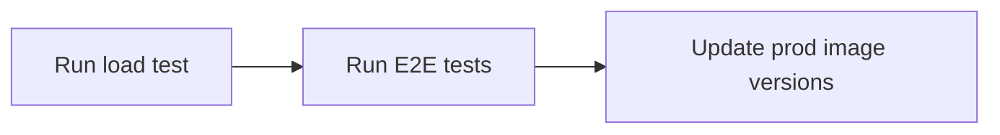

# Deployment

This repository contains the files for local, testing and production deployment

## Folder Structure

```
🗂️── iac                     Holds terraform IAC scripts
🗂️── k8s                     Kubernetes YML files for deployment
|  ├──🗂️ local               k8 local files for deployment to minikube
|  ├──🗂️ test                k8 yml files for deployment to DigitalOcean test environment
|  ├──🗂️ prod                k8 yml files for deployment to DigitalOcean prod environment
🗂️── scripts                 Holds scripts (e.g. for database initialisation)
|  ├──🗂️ e2e                 Playwright end-to-end testing scripts
|  ├── db-init.sql           Database initialisation script
|  ├── db-testdata.sql       Database data seeding script
|  ├── docker-compose.yml    For local development and testing using docker containers
```

## Commands

### Docker

```sh
# starts up services in listed in `docker-compose.yml`
docker-compose up

# starts up services detached listed in `docker-compose.yml`
docker-compose up -d

# stops the services listed in `docker-compose.yml`
docker-compose down
```

### Load Test

[Artillery](https://artillery.io/) is used as the tool for load testing. Ensure that Artillery is [installed](https://www.artillery.io/docs/get-started/get-artillery) before running the script below.

```sh
artillery run load-test.yml
```

### End-to-end Testing

[Playwright](https://playwright.dev/) is used for end-to-end (e2e) testing. Ensure that Playwright is [installed](https://playwright.dev/docs/intro#installing-playwright) before running the script below.

```sh
# Run e2e tests headless
npx playwright test

# Run e2e tests with browser for debugging
npx playwright test --ui
```


## Continuous Delivery

Continuous Deployment is done using [ArgoCD](https://argo-cd.readthedocs.io/en/stable/).

This repository is the target repository for both [frontend](https://github.com/mtechse-dmss-capstone/frontend) and [backend](https://github.com/mtechse-dmss-capstone/backend) to update the image versions of the kubernetes YML files. Upon a successful merge of a pull request to the main branch in the frontend/backend repository, the CI pipeline will update the image version of the kubernetes YML files in this repository. There will be an ArgoCD agent in the kubernetes cluster on hosted on DigitalOcean which listens to version changes in this repository. 

### Promotion to Production

The Continuous Delivery pipeline for promoting to production will be run after the CI pipelines for backend and frontend are executed to update the image versions in the Kubernetes manifest files in this repository under the `k8s/test` folder. At the point where the CD pipeline is run, the DigitalOcean environment would have the latest applications already running.

The promotion to production CD pipeline does the following:



- The pipeline will be manually triggered, after ArgoCD has synced the applications onto the DigitalOcean test environment.
- Pipeline runs load test script against deployed backend on test environment
    - script needs to pass our set threshold to proceed (e.g. 99% http 200, request duration below 100ms)
- Pipeline runs end-to-end tests against the deployed frontend on test environment
    - script needs to pass all defined test cases
- Once load test and e2e tests pass, allow for manual trigger to promote to production environment
- Only the admin is able to promote to production environment (i.e. normal developers not able to promote)
- The ArgoCD agent deployed in the production environment will listen to the changes inside the repository’s k8s/prod folder and deploy the latest application to the production environment accordingly

## Running applications on Kubernetes locally (minikube)

### Installation

1. Install [Docker](https://docs.docker.com/desktop/setup/install/)
2. Install [minikube](https://minikube.sigs.k8s.io/docs/start/)

### Getting Started

Reference: https://stackoverflow.com/questions/58561682/minikube-with-ingress-example-not-working

1. Run the local kubernetes cluster with `minikube start`

2. Enable minikube addons:

```sh
minikube addons enable ingress
minikube addons enable ingress-dns
```

This will start nginx controllers. You can verify with `kubectl get pods -n ingress-nginx`

3. Create the secret for holding the SSL certs with `kubectl create secret tls tls-secret --cert=./tls.crt --key=./tls.key`. Ensure that you have the tls cert and key pair in your folder.

4. Add an entry to your `hosts` file.

- On Windows, you can find it at `c:\Windows\System32\Drivers\etc\hosts`. 
- On MacOS, you can find it at `/etc/hosts`.

```txt
127.0.0.1       localhost
...             ...
127.0.0.1       feats.minikube     # <--- add this
```

5. Apply the kubernetes YAML files in `k8s/local`.

```sh
kubectl apply -f frontend-local.yml backend-local.yml database-local.yml
```

6. Run `minikube tunnel`. You may be prompted to key in a password. Your cursor will hang in place after the password is keyed in. Keep the window open so that you will be able to view the frontend via the set domain name.

7. View the frontend on https://feats.minikube

Alternatively, you can view the frontend through an URL exposed by minikube with this command:

```sh
minikube service --url feats-frontend
```

### Debugging with minikube commands

```sh
# If you built the image locally, you need to load it into Minikube:
eval $(minikube docker-env)  # Point to Minikube's Docker daemon
eval $(minikube docker-env env -u) # Unset from Minikube's Docker daemon

docker build -t your-image-name:latest .  # Build the image locally

# Alternatively, build image directly into Minikube
minikube image build -t your-image-name:latest .

# switch your Docker CLI back to the default Docker daemon
eval $(minikube docker-env --unset)

# view URL of deployed frontend
minikube service feats-frontend --url

# check IP of minikube cluster
minikube ip

# opens the service in your default web browser with the URL and port
minikube service feats-frontend

# add image from local Docker into Minikube daemon
minikube image load image-name:latest
```