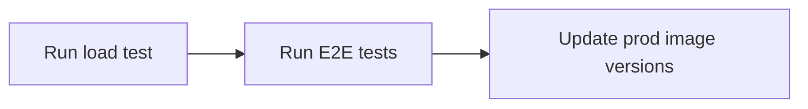

# Deployment

This repository contains the files for local, testing and production deployment

## Folder Structure

```
🗂️── k8s                     Kubernetes YML files for deployment
|  ├──🗂️ local               k8 local files for deployment to minikube
|  ├──🗂️ test                k8 yml files for deployment to DigitalOcean test environment
|  ├──🗂️ prod                k8 yml files for deployment to DigitalOcean prod environment
🗂️── scripts                 Holds scripts (e.g. for database initialisation)
🗂️── iac                     Holds terraform IAC scripts
└── docker-compose.yml       For local development and testing using docker containers
```

## Commands

### Docker

```sh
# starts up services in listed in `docker-compose.yml`
docker-compose up

# starts up services detached listed in `docker-compose.yml`
docker-compose up -d

# stops the services listed in `docker-compose.yml`
docker-compose down
```

### Load Test

[Artillery](https://artillery.io/) is used as the tool for load testing. Ensure that Artillery is [installed](https://www.artillery.io/docs/get-started/get-artillery) before running the script below.

```sh
artillery run load-test.yml
```

## Continuous Delivery

Continuous Deployment is done using [ArgoCD](https://argo-cd.readthedocs.io/en/stable/).

This repository is the target repository for both [frontend](https://github.com/mtechse-dmss-capstone/frontend) and [backend](https://github.com/mtechse-dmss-capstone/backend) to update the image versions of the kubernetes YML files. Upon a successful merge of a pull request to the main branch in the frontend/backend repository, the CI pipeline will update the image version of the kubernetes YML files in this repository. There will be an ArgoCD agent in the kubernetes cluster on hosted on DigitalOcean which listens to version changes in this repository. 

### Promotion to Production

The Continuous Delivery pipeline for promoting to production will be run after the CI pipelines for backend and frontend are executed to update the image versions in the Kubernetes manifest files in this repository under the `k8s/test` folder. At the point where the CD pipeline is run, the DigitalOcean environment would have the latest applications already running.

The promotion to production CD pipeline does the following:



- The pipeline will be manually triggered, after ArgoCD has synced the applications onto the DigitalOcean test environment.
- Pipeline runs load test script against deployed backend on test environment
    - script needs to pass our set threshold to proceed (e.g. 99% http 200, request duration below 100ms)
- Pipeline runs end-to-end tests against the deployed frontend on test environment
    - script needs to pass all defined test cases
- Once load test and e2e tests pass, allow for manual trigger to promote to production environment
- Only the admin is able to promote to production environment (i.e. normal developers not able to promote)
- The ArgoCD agent deployed in the production environment will listen to the changes inside the repository’s k8s/prod folder and deploy the latest application to the production environment accordingly